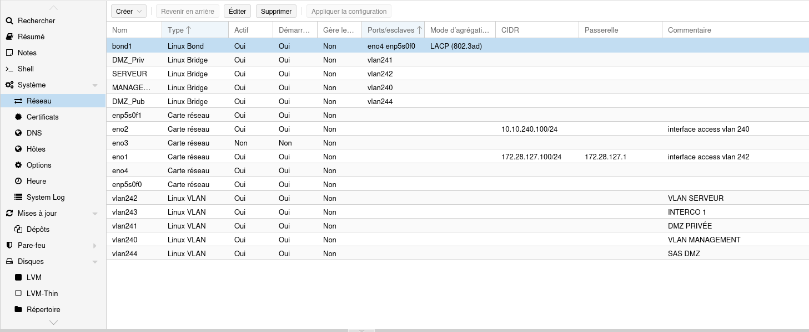

# Configuration des Ports du SERVEUR PROXMOX

### Port eno1
- **Type :** Access
- **Switch :** HUAWEI PROXMOX
- **VLAN :** 242 (SERVICE)
- **IP :** 172.28.127.100

### Port eno2
- **Type :** Access
- **Switch :** HUAWEI PROXMOX
- **VLAN :** 242 (MANAGEMENT)
- **IP :** 10.10.240.100

## LACP

### Création d'un bond1
- **Mode :** Agrégation LACP (802.3ad)
- **Ports utilisés :**
  - **eno4**
  - **enp5s0f0**

### Configuration sur le Switch HUAWEI PROXMOX
- **Ports en mode :** LACP
- **Type :** Trunk (pour permettre le passage de tous les VLANs par le trunk)

## Création des VLANs

Les VLANs suivants utilisent `bond1` comme périphérique support :

- **VLAN 240**
- **VLAN 241**
- **VLAN 242**
- **VLAN 243**
- **VLAN 244**

## Création des Interfaces Bridge

### Linux Bridge
*Ces interfaces permettent aux machines virtuelles d'utiliser les VLANs spécifiques pour la communication réseau.*

| **Nom du Bridge** | **VLAN**    | **Description**                                                 |
|-------------------|-------------|-----------------------------------------------------------------|
| **DMZ_Priv**       | VLAN 241    | Interface pour les machines virtuelles ayant accès à la zone privée de la DMZ. |
| **DMZ_Pub**        | VLAN 244    | Interface pour les machines virtuelles ayant accès à la zone publique de la DMZ. |
| **MANAGEMENT**     | VLAN 240    | Interface dédiée à la gestion des machines virtuelles et des ressources. |
| **SERVEUR**        | VLAN 242    | Interface pour les serveurs virtuels utilisant le VLAN service. |

### Image Proxmox :

