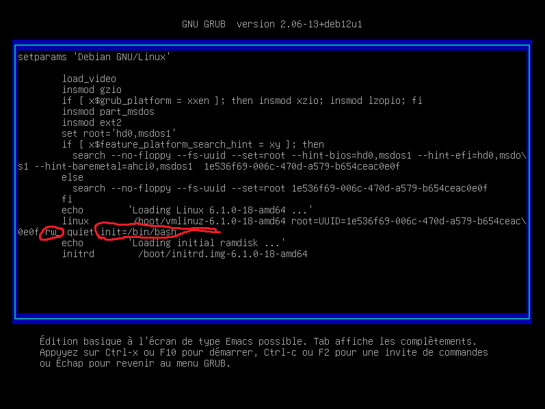

### /!\ A utiiser en dernier recours

# Contexte
Lors de l'installation de la debian nous avons pas mis de mot de passe pour l'utilisateur root.
Nous étions sans connexion donc sudo n'as pas pu s'installer.

# Tuto
Nous allons voir comment reset le mot de passe de l'utilisateur root via grub

Tout d'abord il faut démarrer sur GRUB

# Aller sur Grub

Allumer la machine sur nutanix une fois allumer faire un ctrl + alt + suppr

une fois dans l'interface du bootloader appuyer sur la touche e
Et ajouter ces 2 paramètres :


Une fois fais il suffit de faire F10 pour reboot avec ces paramètres grub.

# Une fois connecter en root faites ceci pour modifier son mot de passe

```bash
passwd root
```
Saisissez les informations

Reboot et vous pourrez vous connecter en root !


